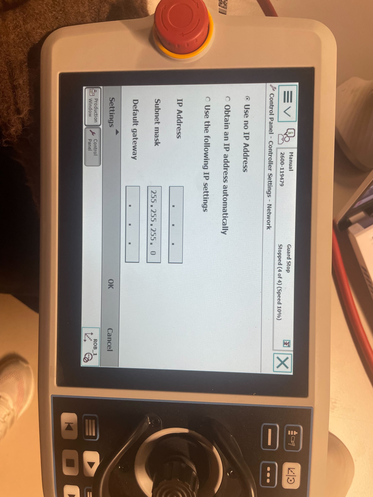

# abb_irb2600_12_185
Temporary Repository - Will move to GIS - Robots or CRCL - Robots later...

## 08.02.2024
### To-Do
- [ ] discuss about tools and grippers

### Log
- Found 8 pts for each robot with two-camera calibration tool, then used points to find matrix transform values
- Setup URDF, see `080224_URDF_Setup` documentation. For video, see [OneDrive](https://epflch.sharepoint.com/:f:/s/ENAC-CRCL/ElpBoSZGSYlPmsWXrB_2PycBLaWoKR6H7JITN1QzPBjTHQ?e=mwP6jv)

## 25.01.2024
### To-Do
- [X] measure 8 points in the space to caculate the world axis transformation

### Log
- Tried to connect via the service port but was initially unsuccessful, need to go to Control Panel -> Settings -> Network -> Use No IP Address to use service port
- `wobj_0` and `ob_RRC_Act` both have same frame where Z is ~1375.997 mm, fixed. Go to robotstudio -> configuration -> motion -> robot to  change the base frame back
- Calibrated with needle tooltip
 

## 11.01.2024
### To-Do
- [X] Prepare for two robots calibration URDF - JW
- [X] Open the medium size robot controller, change the workobject through robotstudio back to the base (Or Change the URDF) - Eric
- [X] Prepare for the calibration tools - Eleni
### Log
- Generate URDF for the irb2600 and moveit package
- Generate dockers for both planning and planning & sending
- Figure out that robot has been changed for its workobject and it is connected to WAN at the moment

